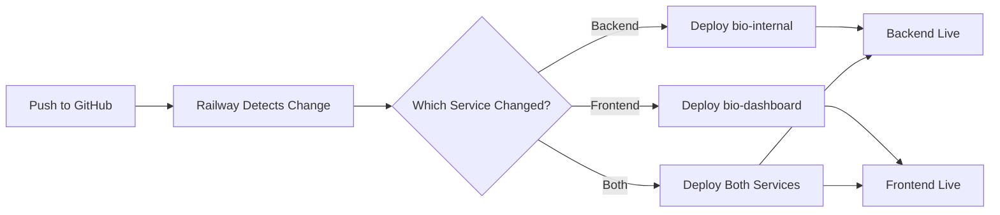

# Railway Deployment: Separate Services Setup

This guide shows how to deploy the frontend and backend as **two separate Railway services**.

## Architecture

```
┌─────────────────────────────────────┐
│ Railway Service 1: Frontend        │
│ ├─ Serves: bio-dashboard (Vite SPA)│
│ ├─ Port: Assigned by Railway       │
│ └─ URL: frontend.railway.app       │
└─────────────────────────────────────┘
                 ↓ HTTP Requests
┌─────────────────────────────────────┐
│ Railway Service 2: Backend API     │
│ ├─ Serves: bio-internal (Elysia)   │
│ ├─ Port: Assigned by Railway       │
│ └─ URL: api.railway.app            │
└─────────────────────────────────────┘
```

## Step-by-Step Setup

### 1. Create Backend API Service

1. Go to Railway dashboard
2. Click "New Project" → "Deploy from GitHub repo"
3. Select this repository
4. **Service name**: `bio-internal-api`
5. **Root directory**: `apps/bio-internal`
6. Railway will auto-detect `railway.json` in that directory
7. **Environment variables** to set:
   ```
   NODE_ENV=production
   DATABASE_URL=your_database_url
   SUPABASE_URL=your_supabase_url
   SUPABASE_SERVICE_KEY=your_supabase_key
   ```
8. Deploy and note the public URL (e.g., `https://bio-internal-api-production.up.railway.app`)

### 2. Create Frontend Service

1. In the same project, click "New Service"
2. Select "GitHub Repo" → Same repository
3. **Service name**: `bio-dashboard-frontend`
4. **Root directory**: `apps/bio-dashboard`
5. Railway will auto-detect `railway.json` in that directory
6. **Environment variables** to set:
   ```
   VITE_API_URL=https://bio-internal-api-production.up.railway.app
   ```
   ⚠️ **Important**: Replace with your actual backend URL from Step 1
7. Deploy

### 3. Verify CORS Configuration

The backend is configured to accept requests from Railway domains. If you use a custom domain, update [server.ts](apps/bio-internal/src/server.ts):

```typescript
origin: (ctx) => {
  const origin = ctx.request.headers.get('origin');
  if (origin && (
    origin.includes('.railway.app') ||
    origin.includes('your-custom-domain.com')  // Add your domain
  )) {
    return origin;
  }
  return false;
}
```

## Configuration Files

### Backend: `apps/bio-internal/railway.json`
- Builds: Installs dependencies with `bun install`
- Starts: Runs `NODE_ENV=production bun run src/index.ts`
- No static file serving

### Frontend: `apps/bio-dashboard/railway.json`
- Builds: Installs deps and runs `bun run build`
- Starts: Runs Vite preview server with `bun run preview`
- Serves built static files

## Local Development

### Backend
```bash
cd apps/bio-internal
bun install
bun run dev  # Runs on http://localhost:4100
```

### Frontend
```bash
cd apps/bio-dashboard
bun install
bun run dev  # Runs on http://localhost:3000
```

Frontend automatically connects to `localhost:4100` in development.

## Benefits of Separate Services

✅ **Independent Scaling**: Scale frontend and backend separately
✅ **Faster Deployments**: Only deploy what changed
✅ **Better Separation**: Clear boundary between frontend and API
✅ **Cost Effective**: Can use different resources for each service
✅ **Easier Debugging**: Logs are separated by service

## Troubleshooting

### CORS Errors
- Verify `VITE_API_URL` environment variable is set correctly in frontend service
- Check backend logs for CORS rejections
- Ensure frontend URL is allowed in backend CORS configuration

### Frontend Shows "API Error"
- Check browser console for the API URL being used
- Verify backend service is running and accessible
- Test backend health endpoint: `https://your-api-url.railway.app/health`

### 404 Errors on Frontend Routes
- Frontend service should use Vite preview server which handles SPA routing
- The `railway.json` uses `bun run preview` which supports this

## Environment Variables

### Backend Service
| Variable | Description | Example |
|----------|-------------|---------|
| `NODE_ENV` | Environment mode | `production` |
| `PORT` | Auto-assigned by Railway | (set by Railway) |
| `DATABASE_URL` | PostgreSQL connection | `postgresql://...` |
| `SUPABASE_URL` | Supabase project URL | `https://xxx.supabase.co` |
| `SUPABASE_SERVICE_KEY` | Supabase service key | `eyJ...` |

### Frontend Service
| Variable | Description | Example |
|----------|-------------|---------|
| `VITE_API_URL` | Backend API URL | `https://api.railway.app` |
| `PORT` | Auto-assigned by Railway | (set by Railway) |

## Deployment Flow



## Costs

Railway charges per service:
- Free tier: $5/month credit (can run both services)
- Hobby plan: $5/service/month
- Pro plan: More resources as needed

With separate services, you have more control over which services run when.
