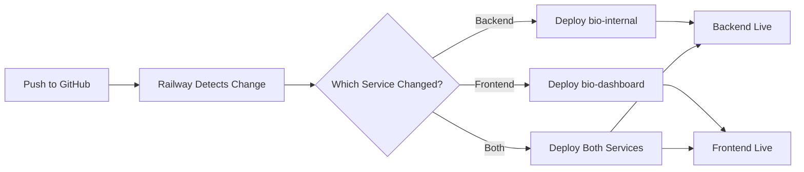

# Railway Deployment Guide

This guide will help you deploy both the bio-dashboard UI and bio-internal API as a single app on Railway.

## Architecture

The deployment combines:
- **Frontend**: Bio Dashboard (Preact/Vite) - served as static files
- **Backend**: Bio Internal API (Bun/Elysia) - serves API routes and static files

The API server runs on port 4100 (or PORT env var) and serves:
- API routes under `/v1`, `/daos`, `/growth`, etc.
- API documentation at `/api-docs`
- Dashboard static files at root `/`

## Prerequisites

1. Railway account (https://railway.app)
2. GitHub repository connected to Railway
3. Required environment variables ready

## Deployment Steps

### 1. Create New Project on Railway

1. Go to https://railway.app
2. Click "New Project"
3. Select "Deploy from GitHub repo"
4. Choose your repository: `bio-sync-bot`

### 2. Configure Environment Variables

Add the following environment variables in Railway dashboard:

**Required:**
```
NODE_ENV=production
PORT=4100
SUPABASE_URL=your_supabase_url
SUPABASE_SERVICE_KEY=your_service_key
SUPABASE_DB_URL=your_database_url
```

**Optional (if using specific features):**
```
TWITTER_BEARER_TOKEN=your_token
DISCORD_BOT_TOKEN=your_token
TELEGRAM_BOT_TOKEN=your_token
# Add any other env vars your app needs
```

### 3. Deploy

Railway will automatically:
1. Run `./deploy.sh` to build the dashboard
2. Install dependencies for both apps
3. Start the server with `cd apps/bio-internal && NODE_ENV=production bun run src/index.ts`

### 4. Access Your App

Once deployed, Railway will provide you with a URL like:
- `https://your-app.up.railway.app` - Dashboard (frontend)
- `https://your-app.up.railway.app/v1/*` - API endpoints
- `https://your-app.up.railway.app/api-docs` - API documentation

## Project Structure

```
bio-sync-bot/
├── apps/
│   ├── bio-dashboard/        # Frontend (Vite + Preact)
│   │   ├── src/
│   │   ├── dist/            # Built files (created during deploy)
│   │   └── package.json
│   └── bio-internal/         # Backend (Bun + Elysia)
│       ├── src/
│       │   ├── index.ts     # Entry point
│       │   ├── server.ts    # Server setup with static file serving
│       │   └── routes/      # API routes
│       └── package.json
├── deploy.sh                 # Build script
├── railway.json             # Railway configuration
├── Procfile                 # Process configuration
└── RAILWAY_DEPLOYMENT.md    # This file
```

## How It Works

1. **Build Phase** (`deploy.sh`):
   - Builds the dashboard into static files (`apps/bio-dashboard/dist`)
   - Installs API dependencies

2. **Runtime**:
   - Bun server starts on specified PORT
   - API routes are registered (health, twitter, growth, daos)
   - Static plugin serves dashboard files from `dist/`
   - SPA routing: 404s fallback to `index.html`

3. **Development vs Production**:
   - **Dev**: Dashboard runs on `:3000`, API on `:4100` (separate processes)
   - **Production**: Single server on Railway serves both

## Local Testing of Production Build

Test the production setup locally:

```bash
# Build the dashboard
cd apps/bio-dashboard
bun install
bun run build

# Start the API server in production mode
cd ../bio-internal
bun install
NODE_ENV=production bun run src/index.ts
```

Then visit `http://localhost:4100` to see the dashboard served by the API.

## Troubleshooting

### Build Fails
- Check Railway build logs
- Ensure `deploy.sh` has execute permissions
- Verify all dependencies are in package.json files

### Static Files Not Serving
- Verify dashboard build created `dist/` folder
- Check `NODE_ENV=production` is set
- Verify path resolution in `server.ts`

### API Routes Not Working
- Check CORS settings in `server.ts`
- Verify environment variables are set
- Check Railway service logs

### 404 Errors on Dashboard Routes
- Ensure `onError` handler in `server.ts` is working
- SPA routing should fallback to `index.html`

## Updating the Deployment

Push changes to GitHub:
```bash
git add .
git commit -m "your changes"
git push
```

Railway will automatically redeploy.

## Alternative: Manual Railway CLI Deployment

Install Railway CLI:
```bash
npm i -g @railway/cli
```

Deploy:
```bash
railway login
railway link
railway up
```

## Cost Optimization

Railway free tier includes:
- 500 hours of execution time
- $5 of usage

Tips:
- Set appropriate sleep settings if not using 24/7
- Monitor usage in Railway dashboard
- Consider horizontal scaling only if needed

## Support

For issues:
1. Check Railway logs
2. Review this guide
3. Check Railway documentation: https://docs.railway.app
4. Contact your team
# Railway Deployment: Separate Services Setup

This guide shows how to deploy the frontend and backend as **two separate Railway services**.

## Architecture

```
┌─────────────────────────────────────┐
│ Railway Service 1: Frontend        │
│ ├─ Serves: bio-dashboard (Vite SPA)│
│ ├─ Port: Assigned by Railway       │
│ └─ URL: frontend.railway.app       │
└─────────────────────────────────────┘
                 ↓ HTTP Requests
┌─────────────────────────────────────┐
│ Railway Service 2: Backend API     │
│ ├─ Serves: bio-internal (Elysia)   │
│ ├─ Port: Assigned by Railway       │
│ └─ URL: api.railway.app            │
└─────────────────────────────────────┘
```

## Step-by-Step Setup

### 1. Create Backend API Service

1. Go to Railway dashboard
2. Click "New Project" → "Deploy from GitHub repo"
3. Select this repository
4. **Service name**: `bio-internal-api`
5. **Root directory**: `apps/bio-internal`
6. Railway will auto-detect `railway.json` in that directory
7. **Environment variables** to set:
   ```
   NODE_ENV=production
   DATABASE_URL=your_database_url
   SUPABASE_URL=your_supabase_url
   SUPABASE_SERVICE_KEY=your_supabase_key
   ```
8. Deploy and note the public URL (e.g., `https://bio-internal-api-production.up.railway.app`)

### 2. Create Frontend Service

1. In the same project, click "New Service"
2. Select "GitHub Repo" → Same repository
3. **Service name**: `bio-dashboard-frontend`
4. **Root directory**: `apps/bio-dashboard`
5. Railway will auto-detect `railway.json` in that directory
6. **Environment variables** to set:
   ```
   VITE_API_URL=https://bio-internal-api-production.up.railway.app
   ```
   ⚠️ **Important**: Replace with your actual backend URL from Step 1
7. Deploy

### 3. Verify CORS Configuration

The backend is configured to accept requests from Railway domains. If you use a custom domain, update [server.ts](apps/bio-internal/src/server.ts):

```typescript
origin: (ctx) => {
  const origin = ctx.request.headers.get('origin');
  if (origin && (
    origin.includes('.railway.app') ||
    origin.includes('your-custom-domain.com')  // Add your domain
  )) {
    return origin;
  }
  return false;
}
```

## Configuration Files

### Backend: `apps/bio-internal/railway.json`
- Builds: Installs dependencies with `bun install`
- Starts: Runs `NODE_ENV=production bun run src/index.ts`
- No static file serving

### Frontend: `apps/bio-dashboard/railway.json`
- Builds: Installs deps and runs `bun run build`
- Starts: Runs Vite preview server with `bun run preview`
- Serves built static files

## Local Development

### Backend
```bash
cd apps/bio-internal
bun install
bun run dev  # Runs on http://localhost:4100
```

### Frontend
```bash
cd apps/bio-dashboard
bun install
bun run dev  # Runs on http://localhost:3000
```

Frontend automatically connects to `localhost:4100` in development.

## Benefits of Separate Services

✅ **Independent Scaling**: Scale frontend and backend separately
✅ **Faster Deployments**: Only deploy what changed
✅ **Better Separation**: Clear boundary between frontend and API
✅ **Cost Effective**: Can use different resources for each service
✅ **Easier Debugging**: Logs are separated by service

## Troubleshooting

### CORS Errors
- Verify `VITE_API_URL` environment variable is set correctly in frontend service
- Check backend logs for CORS rejections
- Ensure frontend URL is allowed in backend CORS configuration

### Frontend Shows "API Error"
- Check browser console for the API URL being used
- Verify backend service is running and accessible
- Test backend health endpoint: `https://your-api-url.railway.app/health`

### 404 Errors on Frontend Routes
- Frontend service should use Vite preview server which handles SPA routing
- The `railway.json` uses `bun run preview` which supports this

## Environment Variables

### Backend Service
| Variable | Description | Example |
|----------|-------------|---------|
| `NODE_ENV` | Environment mode | `production` |
| `PORT` | Auto-assigned by Railway | (set by Railway) |
| `DATABASE_URL` | PostgreSQL connection | `postgresql://...` |
| `SUPABASE_URL` | Supabase project URL | `https://xxx.supabase.co` |
| `SUPABASE_SERVICE_KEY` | Supabase service key | `eyJ...` |

### Frontend Service
| Variable | Description | Example |
|----------|-------------|---------|
| `VITE_API_URL` | Backend API URL | `https://api.railway.app` |
| `PORT` | Auto-assigned by Railway | (set by Railway) |

## Deployment Flow



## Costs

Railway charges per service:
- Free tier: $5/month credit (can run both services)
- Hobby plan: $5/service/month
- Pro plan: More resources as needed

With separate services, you have more control over which services run when.
# Railway Deployment Setup

## Architecture

This project uses a **single-service architecture** on Railway where the backend serves both API and frontend:

```
Railway URL (https://your-app.railway.app)
           ↓
    Elysia Backend (PORT from Railway)
           ↓
    ├── /api/*        → API routes
    ├── /v1/*         → API routes
    ├── /health       → Health check
    └── /*            → Frontend (from apps/bio-dashboard/dist)
```

## How It Works

### Backend (apps/bio-internal)
- Listens on `process.env.PORT` (provided by Railway) or 4100 (local dev)
- Binds to `0.0.0.0` in production for public access
- Serves API routes
- Serves static frontend files in production using Bun's native file serving

### Frontend (apps/bio-dashboard)
- Built as static files to `apps/bio-dashboard/dist`
- API calls use:
  - **Production**: Empty base URL `''` (relative URLs to same domain)
  - **Development**: `http://localhost:4100` (local backend)

## Deployment Process

1. **Build**: `./deploy.sh` builds dashboard and installs dependencies
2. **Start**: Railway runs `cd apps/bio-internal && NODE_ENV=production bun run src/index.ts`
3. **Access**: Frontend and API are both available at your Railway URL

## Environment Variables (Railway)

Required environment variables in Railway dashboard:

```bash
NODE_ENV=production
DATABASE_URL=your_database_url
SUPABASE_URL=your_supabase_url
SUPABASE_SERVICE_KEY=your_supabase_key
# PORT is automatically set by Railway
```

Optional:
```bash
VITE_API_URL=  # Only if you want to override API URL
```

## Local Development

### Frontend (Port 3000)
```bash
cd apps/bio-dashboard
bun install
bun run dev
```

### Backend (Port 4100)
```bash
cd apps/bio-internal
bun install
bun run dev
```

Frontend will proxy API requests to `http://localhost:4100` automatically.

## Alternative: Separate Services

If you need frontend and backend on separate Railway services:

1. Create two services in Railway
2. Deploy backend to Service 1
3. Deploy frontend to Service 2 with:
   ```bash
   VITE_API_URL=https://backend-service-url.railway.app
   ```
4. Configure CORS in backend to allow frontend domain

**Not recommended** - costs 2x and adds complexity.
